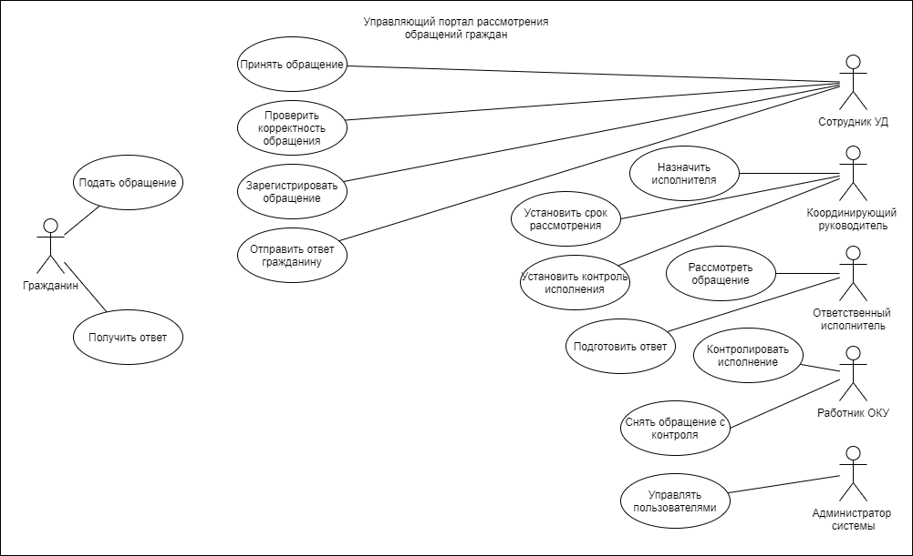

# Лабораторная работа №1
## Формулирование требований к программной системе

### Цель работы
Научиться анализировать поставленную задачу и формулировать функциональные и нефункциональные требования к проектируемой системе.

---

# Перечень заинтересованных лиц (стейкхолдеров)

**Гражданин**  
Лицо, направляющее обращение в организацию и ожидающее рассмотрения и получения ответа.

**Сотрудник Управления делами (УД)**  
Принимает обращения граждан, проверяет их корректность и регистрирует их в системе.

**Координирующий руководитель**  
Определяет ответственного исполнителя обращения, устанавливает срок рассмотрения и контроль исполнения.

**Ответственный исполнитель**  
Рассматривает обращение гражданина и подготавливает официальный ответ.

**Работник ОКУ**  
Контролирует соблюдение сроков рассмотрения обращений.

**Администратор системы**  
Обеспечивает техническое сопровождение системы и управление пользователями.

---

# Перечень функциональных требований

1. Система должна обеспечивать возможность подачи обращения гражданином.
2. Система должна обеспечивать прием обращений сотрудником УД.
3. Система должна обеспечивать проверку корректности обращения.
4. Система должна обеспечивать регистрацию обращения.
5. Система должна обеспечивать назначение ответственного исполнителя.
6. Система должна обеспечивать установку сроков рассмотрения обращения.
7. Система должна обеспечивать установку контроля исполнения обращения.
8. Система должна обеспечивать рассмотрение обращения ответственным исполнителем.
9. Система должна обеспечивать подготовку ответа на обращение.
10. Система должна обеспечивать отправку ответа гражданину.
11. Система должна обеспечивать контроль исполнения обращения.
12. Система должна обеспечивать снятие обращения с контроля после его исполнения.
13. Система должна обеспечивать управление пользователями системы.

---

# Диаграмма вариантов использования

---

# Перечень сделанных предположений

1. Все обращения граждан поступают в систему в электронной форме.
2. Все сотрудники организации имеют учетные записи в системе.
3. Система используется для внутренней работы сотрудников организации.
4. Все обращения хранятся в централизованной базе данных.
5. Пользователи системы имеют разные уровни доступа.

---

# Перечень нефункциональных требований

**Производительность**  
Система должна обеспечивать быструю обработку обращений без значительных задержек.

**Безопасность**  
Доступ к системе должен предоставляться только авторизованным пользователям.

**Надежность**  
Система должна обеспечивать сохранность данных обращений.

**Доступность**  
Система должна быть доступна пользователям в рабочее время.

**Масштабируемость**  
Система должна поддерживать увеличение количества пользователей и обращений.
