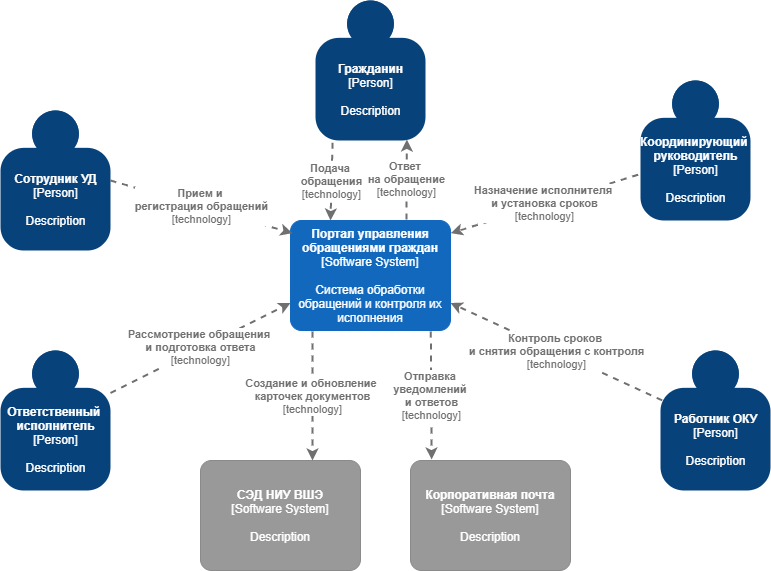
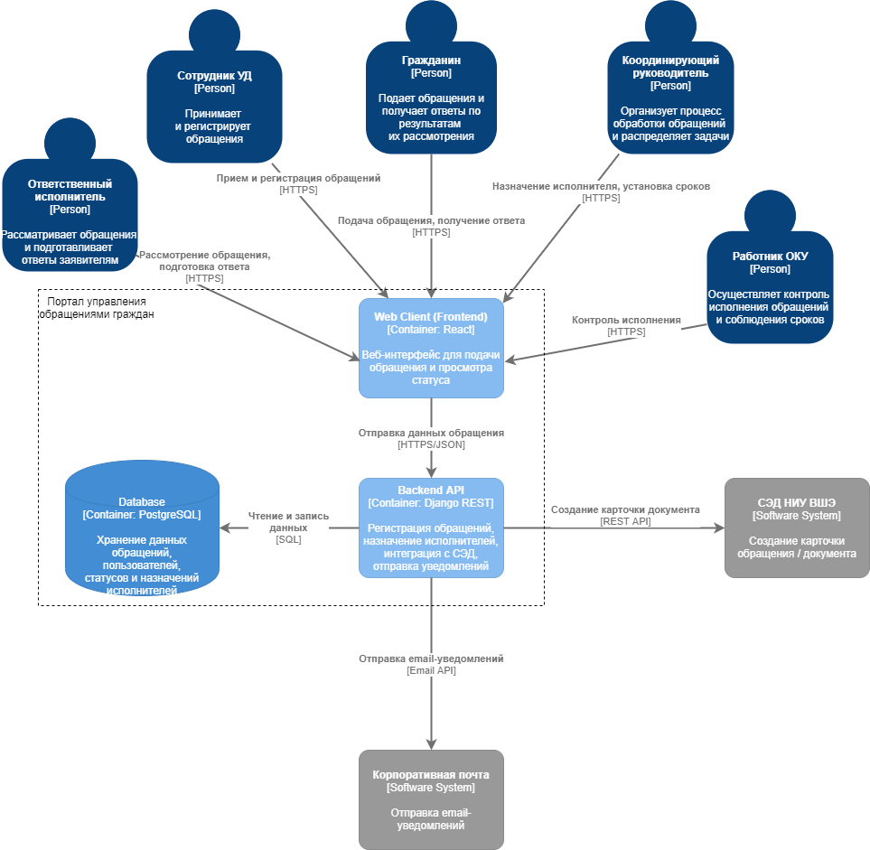
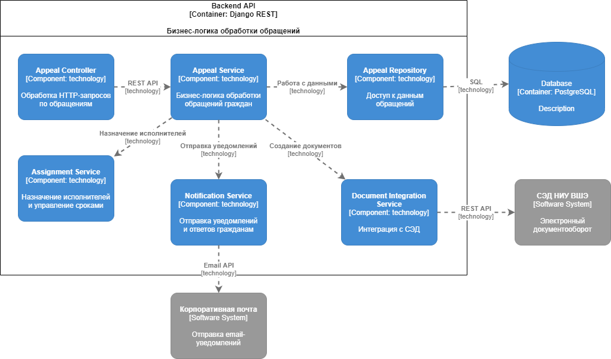

# Лабораторная работа №2

## Тема
Использование нотации C4 Model для проектирования архитектуры программной системы

## Цель работы
Получить практический опыт использования нотации C4 Model для описания архитектуры программной системы и фиксации архитектурных решений.

В качестве примера рассматривается система управления обращениями граждан в образовательной организации. Система предназначена для регистрации обращений, распределения задач между ответственными сотрудниками, контроля сроков исполнения и формирования ответов гражданам.

---

# Диаграмма системного контекста

Диаграмма системного контекста показывает разрабатываемую систему в окружении пользователей и внешних информационных систем. Центральным элементом является портал управления обращениями граждан, который используется сотрудниками организации для обработки обращений.

Основными пользователями системы являются:
- гражданин, подающий обращение и получающий ответ;
- сотрудник управления делами, осуществляющий прием и регистрацию обращений;
- координирующий руководитель, назначающий исполнителей и контролирующий сроки;
- ответственный исполнитель, рассматривающий обращение и подготавливающий ответ;
- работник ОКУ, осуществляющий контроль исполнения.

Система взаимодействует с внешними информационными системами:
- системой электронного документооборота НИУ ВШЭ, в которой регистрируются документы;
- корпоративной почтовой системой, используемой для отправки уведомлений и ответов гражданам.

---

# Диаграмма контейнеров

Диаграмма контейнеров описывает архитектуру программного приложения и основные контейнеры системы.

Архитектура реализована в виде веб-приложения и включает следующие контейнеры:

- **Web Client** — клиентская часть системы, реализующая веб-интерфейс для пользователей;
- **Backend API** — серверная часть системы, содержащая бизнес-логику обработки обращений;
- **Database** — база данных для хранения информации об обращениях, пользователях и статусах обработки.

Пользователи взаимодействуют с системой через веб-клиент, который отправляет запросы к серверной части через REST API. Серверная часть выполняет обработку запросов, взаимодействует с базой данных и интегрируется с внешними системами.

Backend API взаимодействует с:
- системой электронного документооборота НИУ ВШЭ для создания и обновления карточек документов;
- корпоративной почтовой системой для отправки уведомлений и ответов гражданам.

---

# Диаграмма компонентов

Диаграмма компонентов показывает внутреннюю структуру контейнера Backend API и основные программные компоненты системы.

В серверной части выделены следующие компоненты:

- **Appeal Controller** — принимает HTTP-запросы от клиентского приложения и передает их в сервисный слой;
- **Appeal Service** — реализует основную бизнес-логику обработки обращений;
- **Assignment Service** — отвечает за назначение исполнителей и управление сроками выполнения;
- **Notification Service** — выполняет отправку уведомлений пользователям системы;
- **Document Integration Service** — обеспечивает интеграцию с системой электронного документооборота;
- **Appeal Repository** — отвечает за доступ к данным обращений в базе данных.

Такая архитектура соответствует принципам многослойной архитектуры и позволяет разделить ответственность между компонентами системы. Это упрощает поддержку, развитие и масштабирование программного решения.

