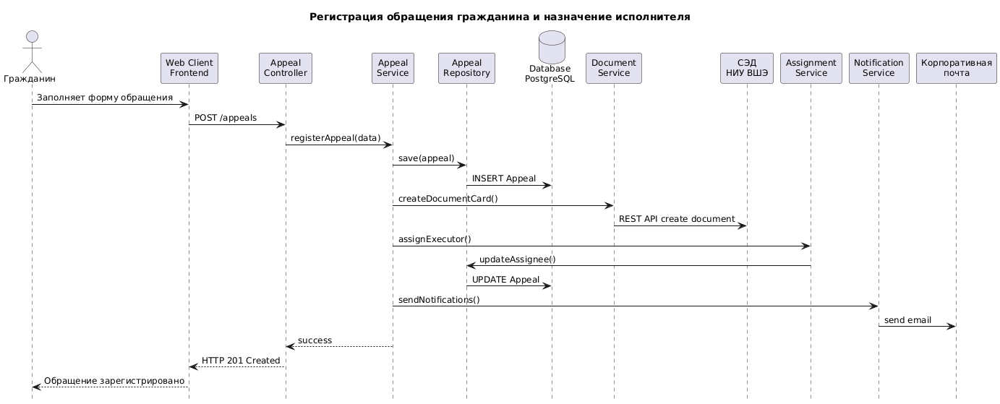
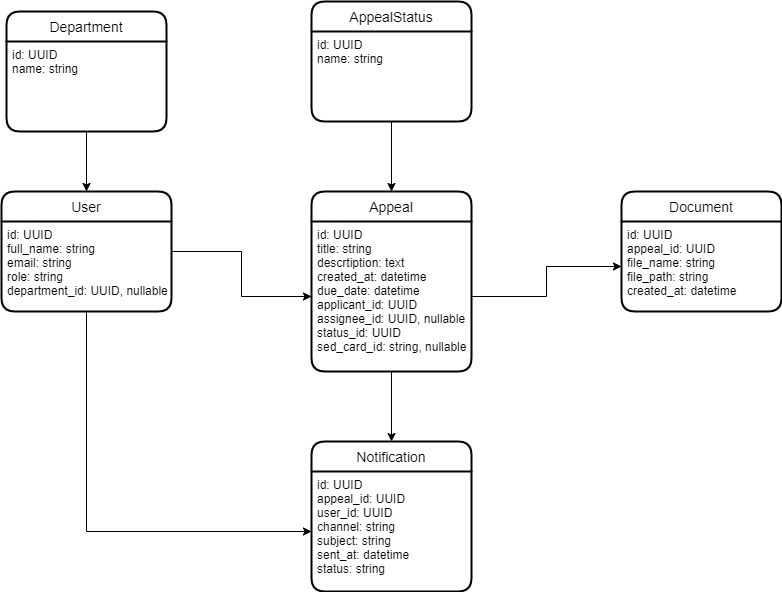

# Лабораторная работа №3

**Использование принципов проектирования на уровне методов и классов**

## Цель работы

Цель лабораторной работы — закрепить навыки архитектурного проектирования программных систем и продемонстрировать применение принципов проектирования **KISS, YAGNI, DRY и SOLID** на уровне компонентов, методов и классов.

В рамках работы уточняется архитектура системы для выбранного варианта использования, строится диаграмма последовательностей, разрабатывается модель базы данных и приводится пример клиентского и серверного кода.

---

# Описание проекта

Проект посвящён разработке **управляющего портала для поддержки бизнес-процесса рассмотрения обращений граждан** в образовательной организации.

Система предназначена для автоматизации следующих функций:

* регистрация обращений граждан;
* назначение ответственного исполнителя;
* контроль сроков обработки;
* взаимодействие сотрудников с обращениями;
* формирование и отправка ответа заявителю;
* интеграция с системой электронного документооборота.

Портал обеспечивает взаимодействие граждан и сотрудников организации через веб-интерфейс и автоматизирует внутренние процессы обработки обращений.

---

# Выбранный вариант использования

В рамках лабораторной работы рассматривается сценарий:

**«Регистрация обращения гражданина и назначение ответственного исполнителя»**

Основные этапы сценария:

1. Гражданин заполняет форму обращения на веб-портале.
2. Клиентское приложение отправляет данные обращения в Backend API.
3. Backend выполняет валидацию данных и сохраняет обращение в базе данных.
4. Система создаёт карточку документа во внешней системе электронного документооборота.
5. Назначается ответственный исполнитель.
6. Система отправляет уведомления участникам процесса.
7. Пользователь получает подтверждение о регистрации обращения.

---

# Диаграмма контейнеров

Архитектура системы реализована в виде набора контейнеров, взаимодействующих между собой.

Основные контейнеры системы:

* **Web Client (React)** — клиентское приложение, предоставляющее веб-интерфейс для пользователей.
* **Backend API (Django REST)** — серверная часть системы, реализующая бизнес-логику обработки обращений.
* **Database (PostgreSQL)** — база данных для хранения информации об обращениях, пользователях и уведомлениях.
* **СЭД НИУ ВШЭ** — внешняя система электронного документооборота.
* **Корпоративная почта** — сервис отправки email-уведомлений.

Контейнерная диаграмма отражает взаимодействие этих компонентов при обработке обращений.


# Диаграмма компонентов

Диаграмма компонентов детализирует внутреннюю структуру контейнера Backend API и показывает основные компоненты системы, участвующие в обработке обращений граждан.

Основные компоненты:

- Appeal Controller — принимает HTTP-запросы от клиента
- Appeal Service — реализует бизнес-логику обработки обращений
- Assignment Service — определяет ответственного исполнителя
- Notification Service — отправляет уведомления пользователям
- Appeal Repository — выполняет операции хранения данных в базе


---

# Диаграмма последовательностей

Диаграмма последовательностей показывает взаимодействие компонентов системы при регистрации обращения гражданина.

В процессе участвуют следующие элементы:

* гражданин;
* клиентское приложение;
* контроллер обработки обращений;
* сервис бизнес-логики;
* репозиторий данных;
* база данных;
* сервис интеграции с СЭД;
* сервис назначения исполнителя;
* сервис уведомлений;
* корпоративная почта.

Основные этапы взаимодействия:

1. Пользователь отправляет данные обращения через веб-интерфейс.
2. Backend API принимает запрос и передает его в сервис обработки обращений.
3. Сервис сохраняет обращение через репозиторий данных.
4. Создается карточка документа в системе электронного документооборота.
5. Назначается ответственный исполнитель.
6. Отправляются уведомления участникам процесса.
7. Пользователь получает подтверждение регистрации обращения.



---

# Модель базы данных

Для хранения данных системы была разработана UML-модель базы данных.

Основные сущности модели:

### Department

Подразделение организации.

Поля:

* id
* name

---

### User

Пользователь системы (гражданин или сотрудник).

Поля:

* id
* full_name
* email
* role
* department_id

---

### Appeal

Обращение гражданина.

Поля:

* id
* title
* description
* created_at
* due_date
* applicant_id
* assignee_id
* status_id
* sed_card_id

---

### AppealStatus

Статус обращения.

Поля:

* id
* name

---

### Document

Документ, связанный с обращением.

Поля:

* id
* appeal_id
* file_name
* file_path
* created_at

---

### Notification

Уведомление о событиях системы.

Поля:

* id
* appeal_id
* user_id
* channel
* subject
* sent_at
* status

Диаграмма отражает связи между сущностями и позволяет определить структуру хранения данных системы.



---

# Применение основных принципов разработки

## 1. KISS

```python
class AssignmentService:
    def assign_executor(self, topic: str) -> str:
        mapping = {
            "documents": "documents@hse.ru",
            "education": "education@hse.ru",
        }
        return mapping.get(topic, "office@hse.ru")
```

**Пояснение**

В данном фрагменте используется простое правило назначения исполнителя по категории обращения. Логика реализована без сложных алгоритмов маршрутизации и дополнительных внешних сервисов. Такой подход делает код понятным и легко поддерживаемым. Использование простых решений для реализации функциональности соответствует принципу KISS — Keep It Simple, Stupid.

---

## 2. YAGNI

```python
class AppealService:
    def register_appeal(
        self,
        title: str,
        description: str,
        applicant_email: str,
        topic: str,
    ) -> Appeal:

        assignee_email = self.assignment_service.assign_executor(topic)

        appeal = Appeal(
            id=str(uuid4()),
            title=title,
            description=description,
            applicant_email=applicant_email,
            status="NEW",
            created_at=datetime.now(),
            assignee_email=assignee_email,
        )

        self.repository.save(appeal)
        return appeal
```

**Пояснение**

Метод реализует только базовую функциональность регистрации обращения: создание объекта, назначение исполнителя и сохранение данных. В коде отсутствуют дополнительные механизмы обработки, такие как сложные workflow-процессы, история изменений, аналитика или дополнительные каналы уведомлений. Это соответствует принципу YAGNI — You Aren’t Gonna Need It, согласно которому реализуется только необходимая функциональность без добавления возможностей, которые пока не требуются.

---

## 3. DRY

```python
def createAppeal(payload):
    response = requests.post(
        "/api/appeals",
        json=payload,
        headers={"Content-Type": "application/json"}
    )

    if response.status_code != 200:
        raise Exception("Не удалось отправить обращение")

    return response.json()
```

**Пояснение**

Логика отправки запроса на создание обращения вынесена в отдельную функцию, которая может использоваться различными компонентами пользовательского интерфейса. Благодаря этому одна и та же операция не дублируется в разных частях приложения. Такой подход уменьшает повторение кода и упрощает поддержку системы, что соответствует принципу DRY — Don't Repeat Yourself.

---

## 4. SOLID — Single Responsibility Principle

```python
class AppealService:
    def __init__(self, repository, notifier, assignment_service):
        self.repository = repository
        self.notifier = notifier
        self.assignment_service = assignment_service


class AssignmentService:
    def assign_executor(self, topic: str) -> str:
        mapping = {
            "documents": "documents@hse.ru",
            "education": "education@hse.ru",
        }
        return mapping.get(topic, "office@hse.ru")
```

**Пояснение**

Ответственность системы разделена между несколькими сервисами. Один сервис отвечает за обработку и регистрацию обращения, а другой — за назначение исполнителя. Каждый класс выполняет одну конкретную функцию и не содержит логики, не относящейся к его назначению. Такое разделение повышает читаемость и упрощает изменение отдельных компонентов системы.

---

## 5. SOLID — Open/Closed Principle

```python
class NotificationSender(ABC):
    @abstractmethod
    def send(self, email: str, subject: str, message: str) -> None:
        pass


class EmailNotificationSender(NotificationSender):
    def send(self, email: str, subject: str, message: str) -> None:
        print(f"Email to {email}: {subject}")
```

**Пояснение**

Система использует абстракцию для отправки уведомлений, от которой наследуются конкретные реализации. При необходимости можно добавить новые способы уведомления (например, Telegram или внутренние уведомления системы), не изменяя существующий код сервисов. Возможность расширения без изменения базовой логики соответствует принципу открытости/закрытости.

---

## 6. SOLID — Liskov Substitution Principle

```python
class NotificationSender(ABC):
    @abstractmethod
    def send(self, email: str, subject: str, message: str) -> None:
        pass


class EmailNotificationSender(NotificationSender):
    def send(self, email: str, subject: str, message: str) -> None:
        print(f"Email to {email}: {subject}")
```

**Пояснение**

Конкретная реализация сервиса уведомлений реализует общий интерфейс и может использоваться везде, где ожидается базовый тип. Замена одной реализации другой не требует изменения кода, использующего данный интерфейс. Это соответствует принципу подстановки Лисков.

---

## 7. SOLID — Interface Segregation Principle

```python
class AppealRepository(ABC):
    @abstractmethod
    def save(self, appeal: Appeal) -> None:
        pass


class NotificationSender(ABC):
    @abstractmethod
    def send(self, email: str, subject: str, message: str) -> None:
        pass
```

**Пояснение**

В системе используются небольшие специализированные интерфейсы. Один интерфейс отвечает за работу с хранилищем обращений, другой — за отправку уведомлений. Компоненты системы зависят только от тех методов, которые им действительно необходимы, что соответствует принципу разделения интерфейсов.

---

## 8. SOLID — Dependency Inversion Principle

```python
class AppealService:
    def __init__(
        self,
        repository: AppealRepository,
        notifier: NotificationSender,
        assignment_service: AssignmentService,
    ) -> None:
        self.repository = repository
        self.notifier = notifier
        self.assignment_service = assignment_service
```

**Пояснение**

Сервис обработки обращений зависит не от конкретных классов хранения данных или отправки уведомлений, а от абстракций. Конкретные реализации передаются через конструктор, что уменьшает связанность компонентов и облегчает замену реализаций или тестирование системы. Такой подход соответствует принципу инверсии зависимостей.

---

## BDUF — Big Design Up Front

BDUF (Big Design Up Front) — это подход к разработке программного обеспечения, при котором архитектура и структура системы подробно проектируются до начала реализации программного кода. Основная цель такого подхода заключается в снижении количества архитектурных ошибок на поздних этапах разработки.

**Применение**

В проекте частично используется подход BDUF, так как перед началом разработки была спроектирована архитектура системы и построены архитектурные диаграммы (диаграмма контейнеров, диаграмма компонентов, диаграмма последовательностей и модель базы данных). Это позволило определить основные компоненты системы и их взаимодействие до начала реализации программного кода.

При этом проектирование не выполнялось в полном объёме заранее. Архитектура уточнялась по мере разработки отдельных модулей системы. Такой подход позволяет избежать излишнего усложнения системы и соответствует современным практикам гибкой разработки.

---

## SoC — Separation of Concerns (разделение ответственности)

SoC (Separation of Concerns) — принцип разработки, предполагающий разделение системы на отдельные компоненты, каждый из которых отвечает за определённую область функциональности. Такой подход уменьшает связанность компонентов и облегчает сопровождение и развитие программной системы.

**Применение**

В системе реализован принцип разделения ответственности между различными уровнями и компонентами архитектуры. Пользовательский интерфейс отвечает за взаимодействие с пользователем, контроллер принимает HTTP-запросы, сервисы реализуют бизнес-логику обработки обращений, а репозитории отвечают за хранение данных.

Такое разделение позволяет изолировать различные аспекты системы, упрощает поддержку кода и делает архитектуру более масштабируемой.

---

## MVP — Minimum Viable Product

MVP (Minimum Viable Product) — это минимально жизнеспособная версия продукта, содержащая только базовый набор функций, необходимых для демонстрации основной идеи системы и проверки её работоспособности.

**Применение**

Разрабатываемая система реализует только минимально необходимый набор функций для обработки обращений граждан. В текущей версии реализованы регистрация обращения, назначение исполнителя, хранение данных и отправка уведомлений.

Более сложные функции, такие как расширенная аналитика, сложные маршруты обработки обращений или дополнительные каналы уведомлений, не включены в текущую версию системы. Это соответствует принципу MVP, при котором сначала создаётся минимально жизнеспособная версия продукта.

---

## PoC — Proof of Concept

PoC (Proof of Concept) — это прототип системы, предназначенный для подтверждения реализуемости выбранных технических решений или архитектурного подхода перед полноценной разработкой программного продукта.

**Применение**

Разрабатываемый прототип системы можно рассматривать как Proof of Concept, демонстрирующий возможность реализации портала для управления процессом рассмотрения обращений граждан. В рамках лабораторной работы реализованы основные архитектурные компоненты системы и показано их взаимодействие.

Целью такого прототипа является подтверждение реализуемости предложенной архитектуры и выбранных технических решений перед дальнейшим развитием системы.

---

# Вывод

В ходе выполнения лабораторной работы была разработана архитектура программной системы для обработки обращений граждан. Были построены архитектурные диаграммы, разработана модель базы данных и приведены примеры кода с применением принципов проектирования.

Применение принципов **KISS, YAGNI, DRY и SOLID** позволило создать модульную архитектуру системы, упрощающую дальнейшее развитие и сопровождение программного продукта.
