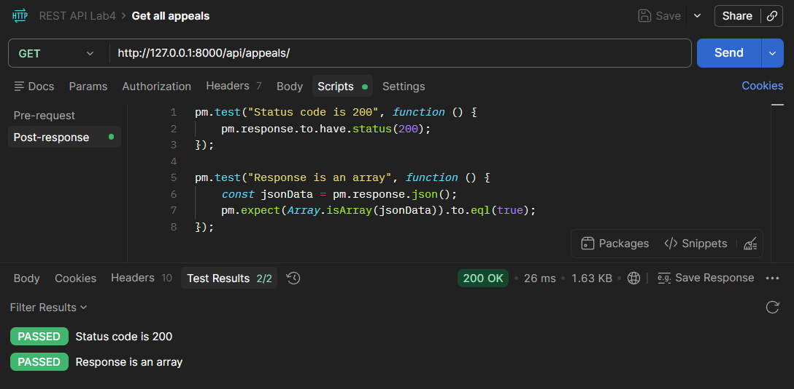
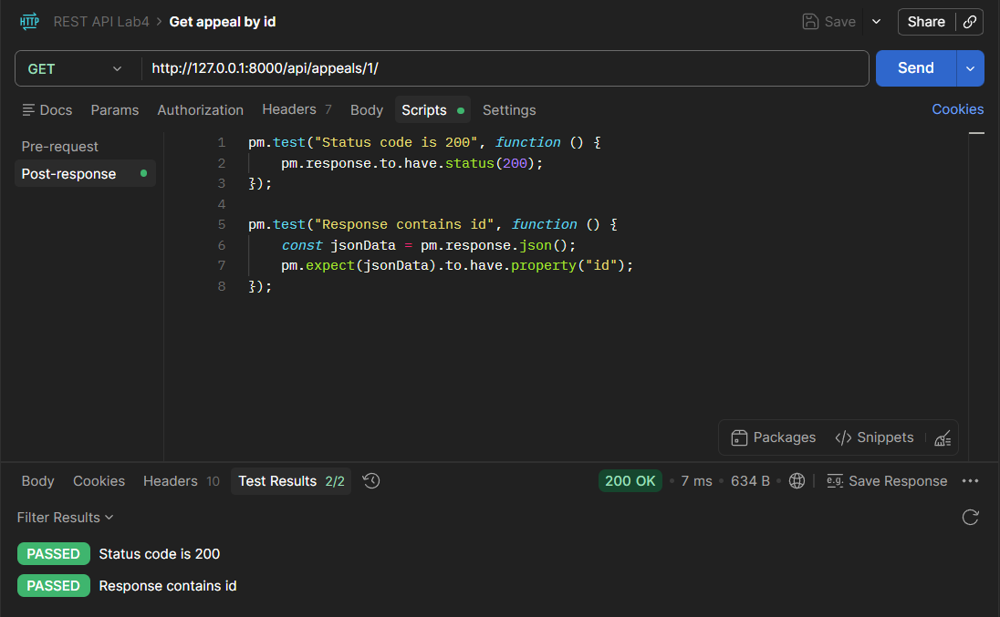
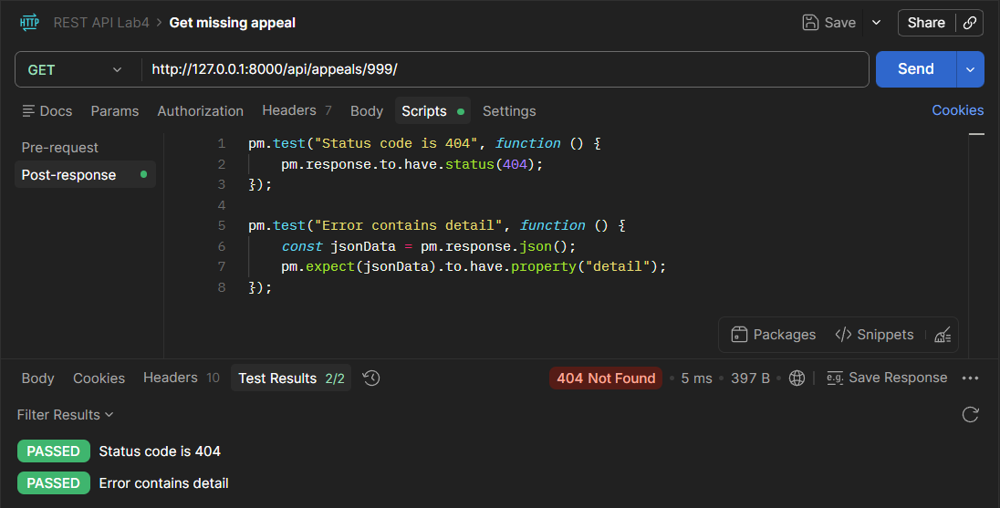
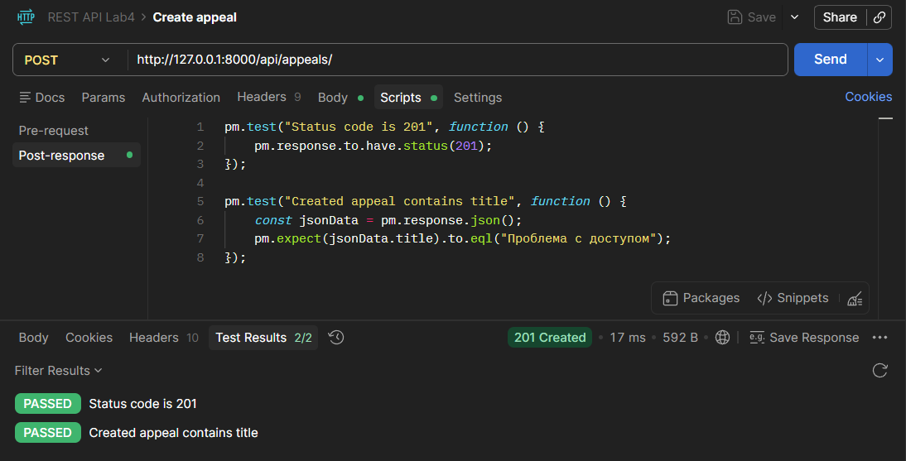
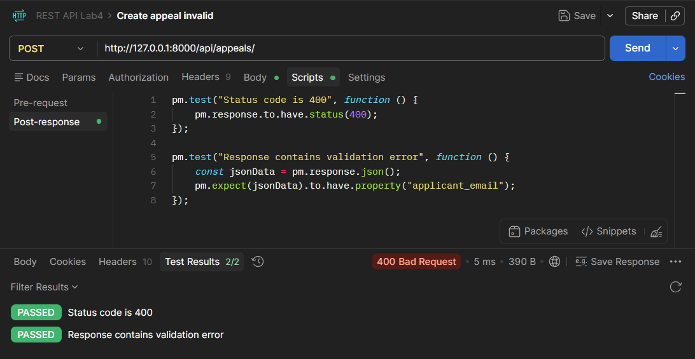
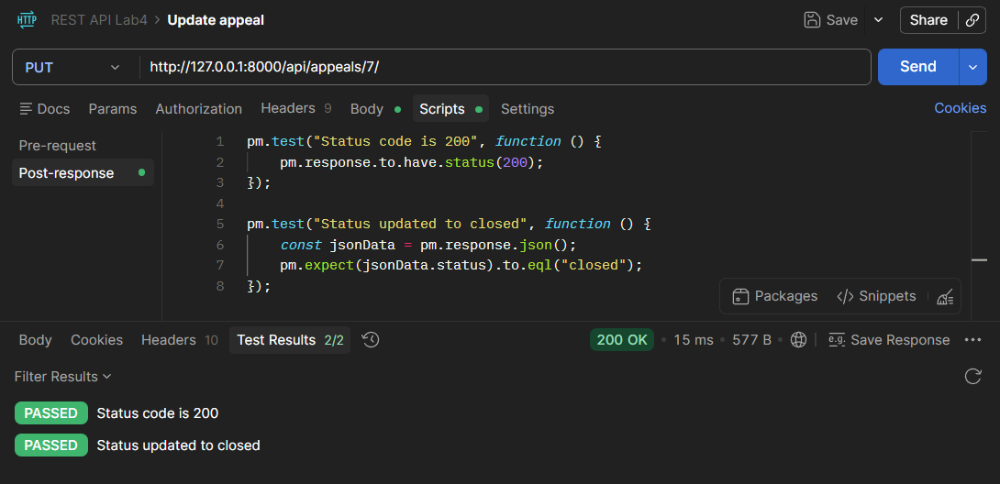
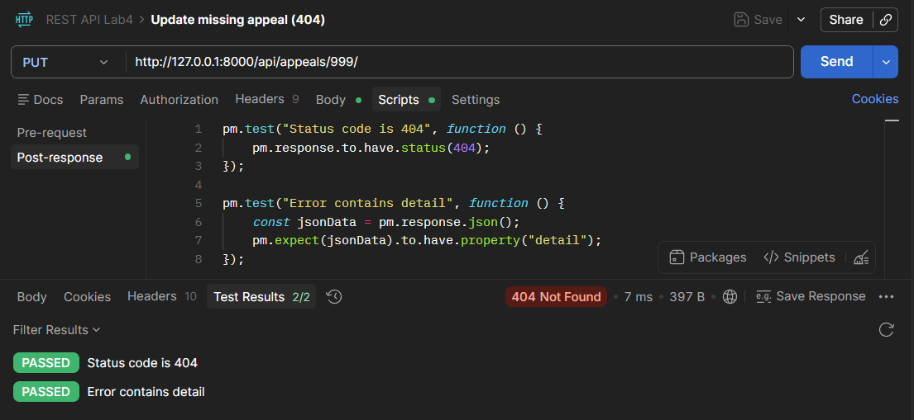
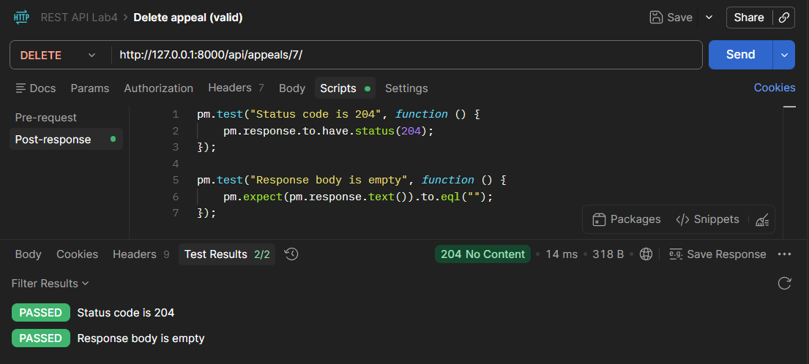
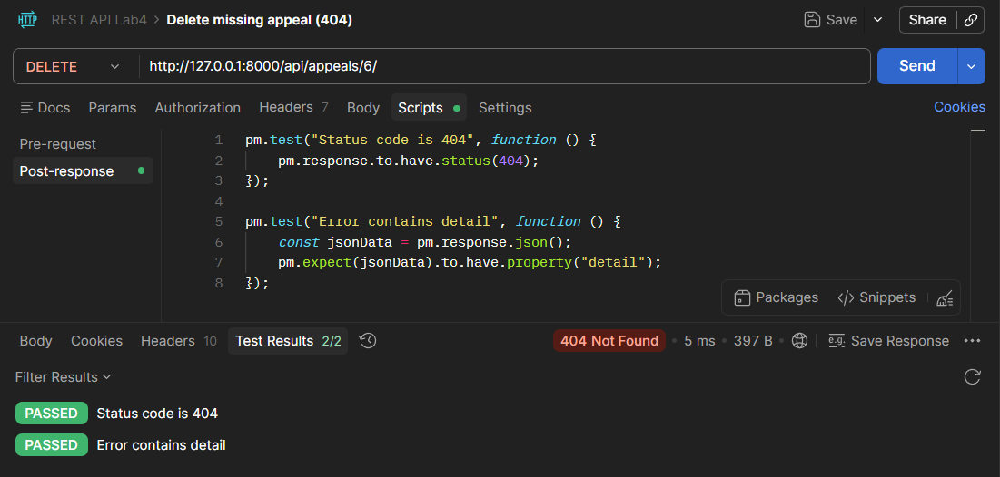

# Лабораторная работа №4  
## Тема: Проектирование REST API для управляющего портала бизнес-процессов  

---

## Цель работы  
Получить практический опыт проектирования и реализации REST API, а также его тестирования с использованием инструментов автоматизации.

---

## 1. Проектные решения  

1. **Протокол взаимодействия**  
   Используется HTTP/1.1 с передачей данных в формате JSON, что обеспечивает универсальность и совместимость с различными клиентскими приложениями.

2. **Архитектурный стиль**  
   API реализован в соответствии с принципами REST. Основным ресурсом системы являются обращения (appeals), доступ к которым осуществляется через стандартные HTTP-методы.

3. **Используемый фреймворк**  
   Для разработки API применён Django REST Framework, что позволило упростить реализацию CRUD-операций и стандартизировать обработку запросов.

4. **Обработка ошибок**  
   Используются стандартные HTTP-коды:
   - 200 OK — успешное выполнение запроса;
   - 201 Created — успешное создание ресурса;
   - 204 No Content — успешное удаление;
   - 400 Bad Request — ошибка валидации данных;
   - 404 Not Found — ресурс не найден.

5. **Валидация данных**  
   Реализована проверка корректности входных данных (например, email), что предотвращает создание некорректных записей.

6. **Идентификация ресурсов**  
   Каждое обращение имеет уникальный идентификатор (id), который используется для доступа к конкретному ресурсу.

7. **Структура API**  
   Все маршруты объединены под префиксом `/api/`, что упрощает навигацию и масштабирование API.

8. **Используемые методы**  
   - GET — получение данных  
   - POST — создание  
   - PUT — обновление  
   - DELETE — удаление  

9. **Stateless-принцип**  
   Сервер не хранит состояние клиента. Все необходимые данные передаются в каждом запросе.

---

## 2. Спецификация API  

### Методы GET  

**GET /api/appeals/**  
Получение списка всех обращений.  

Ответ: возвращается JSON-массив объектов, каждый из которых содержит информацию об обращении (id, название, описание, email заявителя, тема и статус).  

---

**GET /api/appeals/{id}/**  
Получение конкретного обращения по идентификатору.  

Параметры:  
- id — идентификатор обращения  

Ответ: JSON-объект с полной информацией об обращении.  
В случае отсутствия записи возвращается ошибка 404.

---

### Методы POST  

**POST /api/appeals/**  
Создание нового обращения.  

Тело запроса (JSON):  

```json
{
  "title": "Проблема с доступом",
  "description": "Не открывается раздел с документами",
  "applicant_email": "newuser@example.com",
  "topic": "documents",
  "status": "open"
}
```

Ответ:  
- 201 Created — объект успешно создан  
- 400 Bad Request — ошибка валидации данных  

---

### Методы PUT  

**PUT /api/appeals/{id}/**  
Обновление существующего обращения.  

Параметры:  
- id — идентификатор обращения  

Тело запроса (JSON):  

```json
{
  "title": "Проблема с доступом",
  "description": "Не открывается раздел с документами",
  "applicant_email": "newuser@example.com",
  "topic": "documents",
  "status": "closed"
}
```

Ответ:  
- 200 OK — данные успешно обновлены  
- 404 Not Found — обращение не найдено  

---

### Методы DELETE  

**DELETE /api/appeals/{id}/**  
Удаление обращения.  

Параметры:  
- id — идентификатор обращения  

Ответ:  
- 204 No Content — успешное удаление  
- 404 Not Found — обращение не найдено  

---

### Дополнительный метод (заготовка)

**GET /api/appeals/?status={value}**  
Фильтрация обращений по статусу.  

Параметры:  
- status — значение статуса (например open, closed)  

Описание: возвращает список обращений с заданным статусом.  
(Реализация будет добавлена на следующем этапе.)

---

## 3. Тестирование API в Postman  

### Тест 1: Получение списка обращений (GET)  

Запрос: `GET http://127.0.0.1:8000/api/appeals/`  

Передача данных: тело запроса отсутствует.  

Результат: статус 200 OK, возвращается список обращений в формате JSON.



---

### Тест 2: Получение обращения по id (GET)  

Запрос: `GET http://127.0.0.1:8000/api/appeals/1/`  

Передача данных: параметр id передается в URL.  

Результат: статус 200 OK, возвращается объект обращения.



---

### Тест 3: Получение несуществующего обращения (GET)  

Запрос: `GET http://127.0.0.1:8000/api/appeals/999/`  

Результат: статус 404 Not Found, возвращается сообщение об ошибке.



---

### Тест 4: Создание обращения (POST, valid)  

Запрос: `POST http://127.0.0.1:8000/api/appeals/`  

Передача данных: JSON-объект в теле запроса.  

Пример тела запроса:

```json
{
  "title": "Проблема с доступом",
  "description": "Не открывается раздел с документами",
  "applicant_email": "newuser@example.com",
  "topic": "documents",
  "status": "open"
}
```

Результат: статус 201 Created, объект успешно создан.



---

### Тест 5: Создание обращения с ошибкой (POST, invalid)  

Запрос: `POST http://127.0.0.1:8000/api/appeals/`  

Передача данных: некорректный JSON (ошибка в email).  

Пример некорректного тела запроса:

```json
{
  "title": "Ошибка",
  "description": "Некорректный email",
  "applicant_email": "1235",
  "topic": "documents",
  "status": "open"
}
```

Результат: статус 400 Bad Request, ошибка валидации.



---

### Тест 6: Обновление обращения (PUT)  

Запрос: `PUT http://127.0.0.1:8000/api/appeals/7/`  

Передача данных: JSON-объект с обновленными значениями.  

```json
{
  "title": "Проблема с доступом",
  "description": "Не открывается раздел с документами",
  "applicant_email": "newuser@example.com",
  "topic": "documents",
  "status": "closed"
}
```

Результат: статус 200 OK, данные успешно обновлены.



---

### Тест 7: Обновление несуществующего обращения (PUT)  

Запрос: `PUT http://127.0.0.1:8000/api/appeals/999/`  

Результат: статус 404 Not Found.



---

### Тест 8: Удаление обращения (DELETE)  

Запрос: `DELETE http://127.0.0.1:8000/api/appeals/6/`  

Результат: статус 204 No Content, объект удалён.



---

### Тест 9: Удаление несуществующего обращения (DELETE)  

Запрос: `DELETE http://127.0.0.1:8000/api/appeals/6/`  

Результат: статус 404 Not Found.


